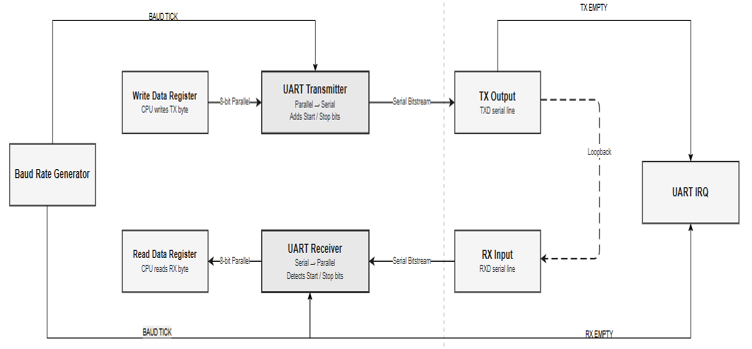
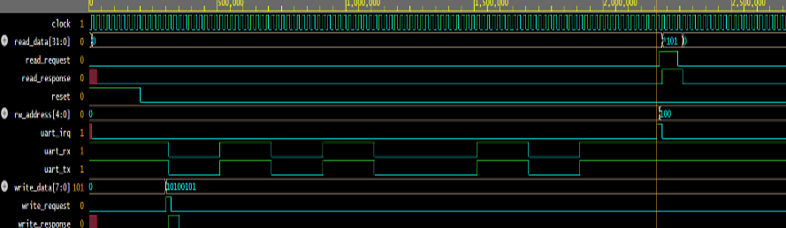

# UART Protocol Using Verilog

## Overview

This project presents the design and verification of a Universal Asynchronous Receiver Transmitter (UART) Protocol using Verilog HDL.

The implementation supports asynchronous serial communication through dedicated UART Transmitter and Receiver modules, baud-rate-controlled communication, memory-mapped register access, interrupt generation, and loopback verification.

The design demonstrates key digital design concepts such as serial communication, baud-rate generation, register-based interfaces, interrupt handling, and simulation-based verification.

---

## Features

* UART Transmitter Design
* UART Receiver Design
* Baud Rate Generator
* Memory-Mapped Register Interface
* UART Interrupt Generation
* Loopback Verification
* Parallel-to-Serial Conversion
* Serial-to-Parallel Conversion
* Comprehensive Testbench Validation

---

## UART Protocol Overview

UART (Universal Asynchronous Receiver Transmitter) is a widely used serial communication protocol that enables data exchange between digital systems without requiring a shared clock signal.

UART communication uses two communication lines:

| Signal | Description        |
| ------ | ------------------ |
| TX     | Transmit Data Line |
| RX     | Receive Data Line  |

Both devices communicate using a predefined baud rate to maintain synchronization.

---

## UART Frame Format

The UART frame implemented in this project consists of:

| Field     | Size   |
| --------- | ------ |
| Start Bit | 1 Bit  |
| Data Bits | 8 Bits |
| Stop Bit  | 1 Bit  |

Total Frame Length = 10 Bits


---

## System Architecture

The UART system consists of:

* Baud Rate Generator
* UART Transmitter
* UART Receiver
* Write Data Register
* Read Data Register
* UART Interrupt Logic
* Loopback Verification Path

The transmitter converts parallel data into serial UART frames, while the receiver reconstructs received serial data back into parallel form.



---

## Signal Interface

| Signal        | Direction | Description             |
| ------------- | --------- | ----------------------- |
| clk           | Input     | System Clock            |
| reset         | Input     | UART Reset              |
| rw_address    | Input     | Register Address        |
| write_request | Input     | Write Enable Signal     |
| write_data    | Input     | Data To Be Transmitted  |
| read_data     | Output    | Received Data           |
| uart_tx       | Output    | Serial Transmit Line    |
| uart_rx       | Input     | Serial Receive Line     |
| uart_irq      | Output    | Reception Interrupt     |
| baud_tick     | Internal  | Baud Rate Timing Signal |

---

## Register Map

| Register     | Address | Access | Description                        |
| ------------ | ------- | ------ | ---------------------------------- |
| REG_WDATA    | 0x00    | Write  | Transmit Data Register             |
| REG_RDATA    | 0x04    | Read   | Receive Data Register              |
| REG_READY    | 0x08    | Read   | Transmitter Status Register        |
| REG_RXSTATUS | 0x0C    | Read   | Receiver Interrupt Status Register |

---

## UART Transmitter

### Features

* Asynchronous Serial Communication
* Automatic Start Bit Generation
* Automatic Stop Bit Generation
* Parallel-to-Serial Conversion
* Baud-Rate Controlled Transmission
* Register-Based Data Transmission
* Transmission Status Monitoring

### Working

1. CPU writes data into Transmit Data Register.
2. UART frame is constructed.
3. Start Bit is transmitted.
4. Data bits are transmitted in LSB-first order.
5. Stop Bit is transmitted.
6. TX returns to idle state.

---

## UART Receiver

### Features

* Start Bit Detection
* Serial-to-Parallel Conversion
* Half-Baud Synchronization
* Stop Bit Verification
* Receive Data Register Storage
* Interrupt Generation

### Working

1. RX line monitors incoming data.
2. Start Bit is detected.
3. Receiver synchronizes at half-baud period.
4. Data bits are sampled.
5. Stop Bit is verified.
6. Received byte is stored.
7. Interrupt is generated.

---

## Interrupt Generation

The UART module generates an interrupt whenever a valid UART frame has been successfully received.

The interrupt remains active until:

* Processor acknowledges the interrupt
* Receive Data Register is read

This eliminates continuous polling and improves communication efficiency.

---

## Loopback Verification

A loopback configuration is implemented by connecting:

```text
UART TX ---> UART RX
```

This enables automatic verification of transmitted and received data without requiring external hardware.

---

## Testbench Design

### Testbench Features

* Automatic 50 MHz Clock Generation
* Reset Generation
* UART Transmission Verification
* UART Reception Verification
* CPU Read/Write Transactions
* Register Access Validation
* Loopback-Based Verification

---

## Simulation Result

The UART module was successfully verified using loopback communication.



---

## Applications

* Embedded Systems
* FPGA-Based Designs
* Processor Communication
* Serial Debug Interfaces
* Industrial Automation
* IoT Systems
* Microcontroller Communication

---


## Advantages

* Simple Communication Protocol
* Requires Only TX and RX Lines
* Supports Full-Duplex Communication
* Easy Hardware Implementation
* Widely Supported Across Platforms

---

## Limitations

* Lower Speed Compared to SPI
* No Shared Clock Synchronization
* Limited Multi-Device Support
* Limited Error Detection Capability


---


## Author

**Nensi Thummar**

Electronics and Communication Engineering

Nirma University

---

## References

1. UART Protocol Specification
2. UART Technical Reference Manual
3. Samir Palnitkar – Verilog HDL: A Guide to Digital Design and Synthesis
4. M. Morris Mano – Digital Design
